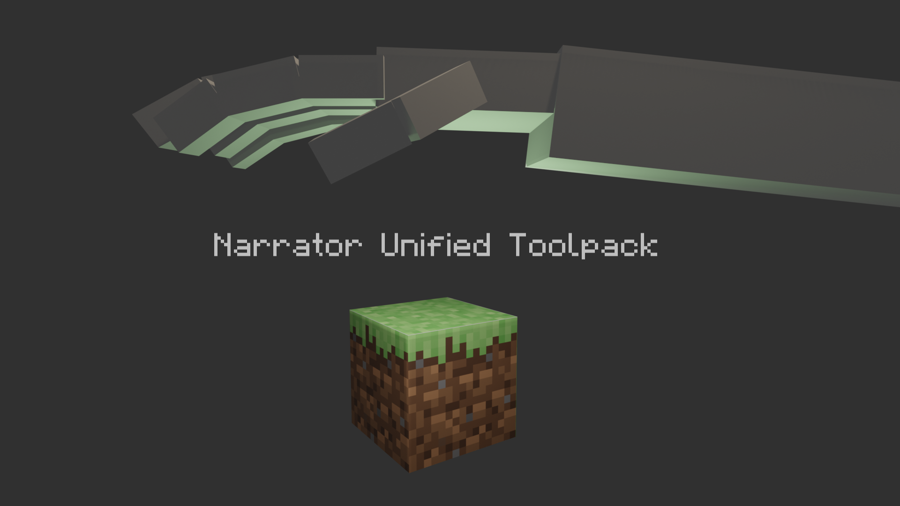

# MCStructure.js



A NodeJS package under Upper Narrator Unified Toolpack project. The package provides API to read and write .mcstructure files generated by MCBE. It also can be used in saved structures in MCBE archive db.

This package is avaliable on browser.

# Install
```shell
npm i mcstructure-js
```

# Usage
Read:
```js
const MCS = require("mcstructure-js")
    , fs = require("fs");

var st = MCS.deserialize(fs.readFileSync("./chests.mcstructre"));

console.log(st.getBlock({x: 0, y: 0, z: 0}));
```

Write:
```js
const MCS = require("mcstructure-js")
    , PMR = require("project-mirror-registry")
    , fs = require("fs");

var st = new MCS(5, 5, 5)
  , bl = PMR.createUniversalTag("block")
  , be = PMR.createBlockEntity("commandBlock");

bl.name = "minecraft:command_block";
be.Command = "say Hello Minecraft!";

st.setBlock({x: 2, y: 2, z: 2}, bl);
st.setBlockData({x: 2, y: 2, z: 2}, be);
```

# API Document
See [API.md](https://github.com/HTMonkeyG/MCStructure.js/docs/API.md).

# Relative Repositories

- [Project-Mirror-Registry](https://github.com/HTMonkeyG/Project-Mirror-Registry) - A NodeJS package produces template data of MCBE NBT.
- [Narrator.js](https://github.com/HTMonkeyG/Narrator-js) - A NodeJS package provides API to operate MCBE archive data directly.
- [ParseNBT.js](https://github.com/HTMonkeyG/ParseNBT.js) - A NodeJS package for reading and writing NBTs like vanilla JS objects.